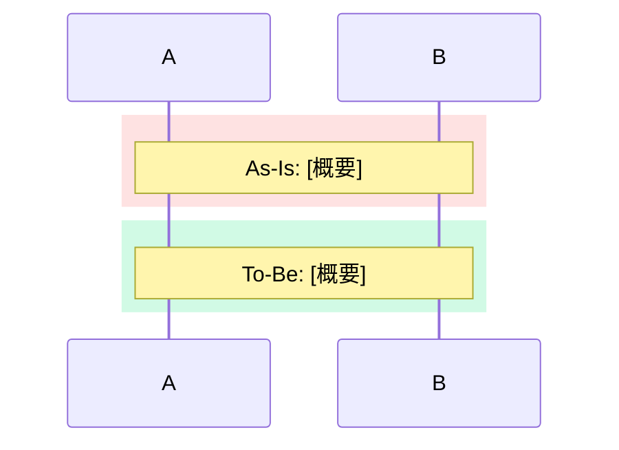
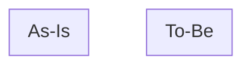

# As-Is / To-Be Diagram Generator

PR diff やローカル変更から、変更前後のフローを比較可視化する。

## Workflow

### Step 1: 差分の取得

引数を解析して差分を取得する。

- **PR 番号/URL**: `gh pr view <number> --json title,body,files` + `gh pr diff <number>`
- **引数なし**: `git diff` + `git diff --cached`
- **ファイル指定**: そのファイルの差分のみ対象

### Step 2: 図種の自動選択

| 変更の特徴 | 図種 |
|---|---|
| イベントリスナー、API呼び出しチェーン、複数actor間のやりとり | **シーケンス図** |
| 条件分岐の追加/変更、ガード条件、バリデーション | **フローチャート** |
| ステータス/状態の追加/変更、ライフサイクル | **状態図** |
| API/記法の置き換え、フレームワーク回避策、依存ライブラリ起因 | **サマリー + テキスト図のみ**（Mermaid スキップ） |
| 複合する場合 | 最も支配的なパターンの図種 |

### Step 3: 図の生成

**共通ルール:**
- 変更に直接関係するフローのみ描く
- 参加者/ノード名は実際のコード上の名前を使う
- ノード数は20以下に抑える

**2種類の出力を両方生成する:**

#### 出力A: Mermaid コードブロック（GitHub 用）

GitHub PR/Issue/コメントにそのまま貼れる形式。

**シーケンス図** — `rect` で背景色を分ける:
````markdown

````

**フローチャート** — `subgraph` で並べる:
````markdown

````

**状態図** — As-Is と To-Be を別々の図で:
````markdown
**As-Is:**
```mermaid
stateDiagram-v2
    %% 変更前
```

**To-Be:**
```mermaid
stateDiagram-v2
    %% 変更後（追加をnoteで強調）
```
````

#### 出力B: テキスト図

Mermaid 非対応の環境にも貼れるプレーンテキスト形式。
コードブロック（` ``` `）で囲んで出力する。

**3つのスタイルから変更内容に最適なものを選択する:**

**実行トレース風（推奨）:**

コードの実行順に沿って、具体的な変数値・評価結果を添えたウォークスルー形式。
ロジック変更やアルゴリズム変更の理解に最適。罫線ボックス `┌┘│▼` で処理ブロックを囲み、
各ステップで何が起きるかを具体値付きで記述する。

```
== As-Is: [タイトル] ==

── Step 1: ステップ名 ──────────────────
         │
         ▼
┌──────────────────────────────────────┐
│ 処理ブロックの説明                    │
│ variable = someFunction()            │
│   → 具体的な値                       │
└──────────────────────────────────────┘

── Step 2: ステップ名 ──────────────────
         │
         ▼
┌──────────────────────────────────────┐
│ ⚡ ここで差が出る                     │
│ condition → false ❌                 │
└──────────────────────────────────────┘
         │
         ▼
   ❌ 最終結果


== To-Be: [タイトル] ==

── Step 1: ステップ名 ──────────────────
         ...（同じステップ構成）

── Step 2: ステップ名 ──────────────────
         ...
         │
         ▼
   ✅ 最終結果
```

ルール:
- As-Is と To-Be は同じ Step 番号・同じステップ名で揃える
- `── Step N: ラベル ──` でフェーズを明示
- `⚡` で As-Is / To-Be の分岐点（ここで差が出る）を強調
- `→` で評価結果を示す
- `✅` / `❌` で成否を明示
- 変数名・関数名は実際のコードと一致させる
- boolean 複合条件は各項を個別評価し `∴` で最終結果をまとめる
- 読者はコーダー前提。ビジネス説明は不要、コード上の理由のみ記述
- **全ボックスの幅を統一する。As-Is / To-Be 通して最も幅が広いボックスに合わせる**
  - 目的: 見やすさと対比の明確さ。幅が揃っていると同じ Step 同士を目で追いやすい
  - 短い内容のボックスも同じ幅にパディングする
  - Step 4 等の最終ステップもボックスに入れて統一感を出す

**シーケンス風:**
```
[As-Is]
User -> App : タブをタップ
App -> Nav : tabPress (直近のnavigatorのみ)

[To-Be]
User -> App : タブをタップ
App -> Nav : tabPress (全tab navigatorを監視)
```

**状態風:**
```
[As-Is]  Pending → Confirmed → Completed
[To-Be]  Pending → Validated → Confirmed → Completed
                    ^^^^^^^^ (追加)
```

**スタイル選択の判定基準:**

| 変更内容 | スタイル |
|----------|---------|
| ロジック変更・条件分岐・アルゴリズム変更 | **実行トレース風** |
| actor 間の通信・API呼び出し順 | **シーケンス風** |
| ステータス遷移・ライフサイクル | **状態風** |

**重要: テキスト図は必ず As-Is と To-Be の両方を同じスタイルで出力する。**
As-Is では「なぜ問題が起きるか」を実行トレースで示し、To-Be では「どう解決されるか」を示す。
それぞれに見出し `## As-Is` `## To-Be` を付け、最後に `✅` or `❌` で結果を明示する。

### Step 4: 変更サマリー

サマリーは2部構成で出力する:

**1. 核心**: この変更で何が根本的に変わったか。diffの本質を簡潔に。
テキスト図の `⚡` 分岐点と対応させる。必要に応じて複数行でも可。

**2. 観点別リスト**: 技術的な変更点を対比する。インデントリスト形式で出力する。

```
**核心**: [変更の本質を簡潔に]

■ 観点名
    As-Is: ...
    To-Be: ...

■ 観点名
    As-Is: ...
    To-Be: ...
```

## Output Order

1. サマリーテーブル
2. テキスト図 As-Is + To-Be
3. Mermaid コードブロック
